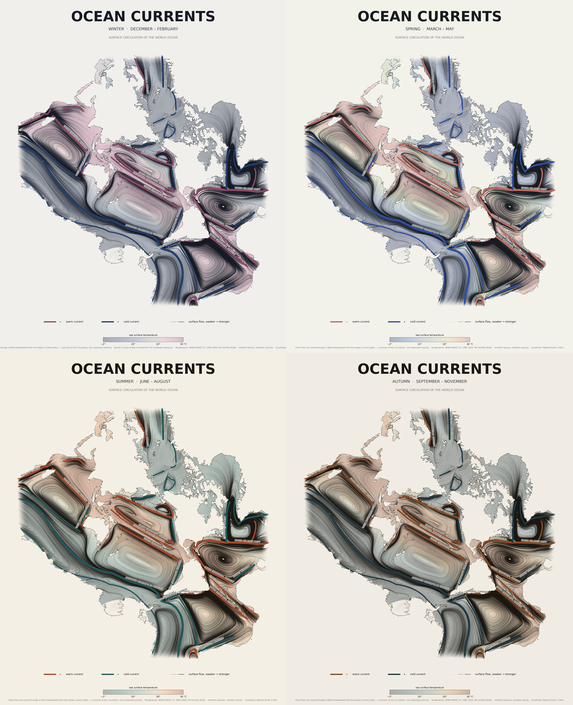
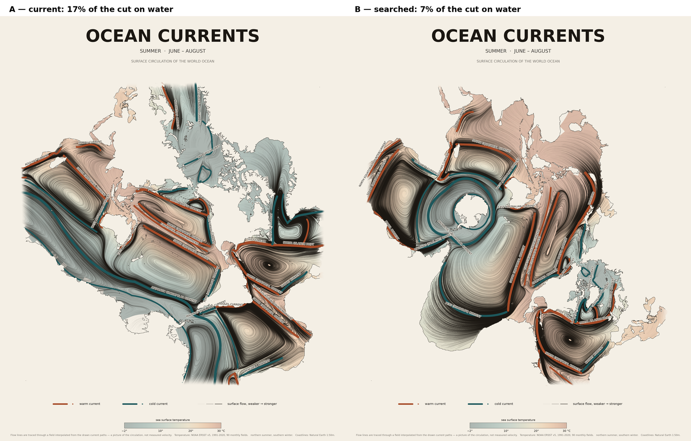

# The world ocean — currents and temperature

Two print-ready posters (PNG + PDF) built from the same data.

## 1. Ocean currents, by season — `make_flow_poster.py`



The currents carry the image: the whole ocean is drawn as flow lines, with sea
surface temperature underneath as a wash. Four seasons, each with its own paper,
ink and temperature ramp (`palettes.py`):

| season | months | cold end | warm end | paper |
| --- | --- | --- | --- | --- |
| winter | Dec–Feb | deep blue-violet | blush and plum | cool off-white |
| spring | Mar–May | periwinkle | celadon into soft coral | pale neutral |
| summer | Jun–Aug | deep teal | sand into terracotta | warm cream |
| autumn | Sep–Nov | smoky slate | ochre into rust | oat |

Seasons are named for the northern hemisphere; each poster says so. Only the
temperature field changes between them — the current paths are the same, with
one exception: the **Somali Current reverses with the monsoon** and is drawn
running southwestward, and weaker, in the winter poster.

The map is **ocean-centred**: Adams "world in a square II" on a rotated globe,
oriented so the map's cut runs almost entirely through land. The world ocean
comes out as one uninterrupted body with the continents pushed to the edges —
the idea behind Spilhaus's ocean map. The rotation in `oceanmap.SPILHAUS` was
picked by searching for the orientation that puts the most land on the cut
(~79% of it); the remaining stretch shows as a straight edge across water.
Land is painted in the paper colour, so only coastlines are drawn and the ocean
floats on the page.

```bash
python make_flow_poster.py --all           # the four seasons, ~2 min each
python make_flow_poster.py --season winter # just one
python make_flow_poster.py                 # the annual-mean palette
python make_flow_poster.py --wash 0        # currents only, no temperature
python make_flow_poster.py --seeds 20000   # denser flow texture
python make_flow_poster.py --seed 3        # a different set of flow lines
python make_flow_poster.py --fade 0        # hard edge instead of the fade
```

### The edge

The map's four sides are the cut where the globe is opened into a square. About
17% of that cut falls on water — mostly the gap between Africa and Antarctica,
and the seas around Iceland — and there the ocean would end in a ruled line. The
drawing is faded into the paper over the last few percent of the map (`--fade`)
so the edge dissolves instead. A rotation exists that cuts only ~7% water
(`--proj "+proj=ob_tran +o_proj=adams_ws2 +o_lat_p=24 +o_lon_p=114 +lon_0=-69
+R=6378137 +no_defs +over"`), but it rearranges the continents and slices the
equatorial Atlantic instead.

## 2. Temperature with currents over it — `make_poster.py`


The earlier layout, where temperature is the subject and the named currents are
drawn over it as arrows.

```bash
python make_poster.py                       # polar disc (whole globe)
python make_poster.py --projection robinson # wide Pacific-centred world map
python make_poster.py --month 1             # January instead of the annual mean
```

## Running

```bash
pip install numpy scipy matplotlib netCDF4 cartopy pyproj pillow shapely
```

The first run caches `ersstv5.nc` (19 MB, not committed) next to the scripts and
the Natural Earth shapefiles in cartopy's own cache.

Each render writes a PNG and a PDF. Only the PDFs and the small previews are
committed; the full-resolution PNGs are ~12 MB each and are regenerated by
re-running the scripts.



## What the data is

**Temperature** — NOAA ERSST v5, the 2° monthly sea surface temperature
analysis, averaged into a 1991–2020 annual-mean climatology (360 fields), or the
30 instances of one calendar month with `--month`. The 2° grid is flood-filled
across land, blurred and resampled so the field reads as a fluid; the land mask
is re-applied afterwards and coastlines come from Natural Earth 1:50m.

**Currents** — `currents.py` holds schematic centrelines for 41 named surface
currents, digitised from standard oceanographic charts. Real currents in real
places, but the geometry is a drawn generalisation: line width encodes relative
strength, not speed in m/s, and no eddies or seasonal reversals are shown (the
Somali Current in particular reverses with the monsoon; it is drawn in its
summer state).

**Flow lines** — `flowfield.py` turns those centrelines into a continuous field:
each path's direction is splatted onto a lon/lat grid at two scales, a tight one
that keeps the named currents sharp and a broad one that lets the direction
bleed into the water between them. Dividing by the splatted weight gives a
direction defined over the whole ocean; the weight itself becomes the strength
that sets each line's darkness and width. Particles are then advected through
it. **This is not a measured velocity field** — it is the drawn circulation
where a current was drawn, and an interpolation everywhere else. The gyres it
produces are a consequence of the currents that bound them, not an independent
observation.

## Files

| file | what it does |
| --- | --- |
| `currents.py` | the 41 current paths, plus where to anchor each name |
| `flowfield.py` | centrelines → flow field → streamlines |
| `oceanmap.py` | the ocean-centred projection, land bitmap, raster sampling |
| `palettes.py` | the four seasonal colour schemes and the monsoon override |
| `make_flow_poster.py` | poster 1: currents, one render per season |
| `make_poster.py` | poster 2: temperature, and the shared SST loading/palette |
